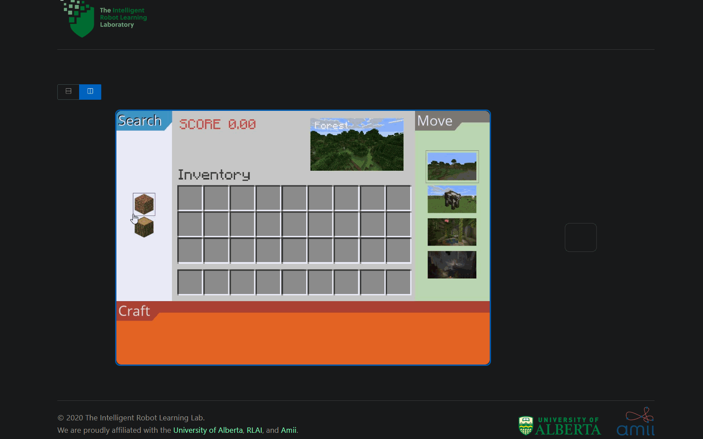

# Hierachical explanation graphs : User study

Design of hierachical explanation as graphs for AI to Human teaching.
The goal of this research is to study graphs as a mean to transfer knowledge to humans.

# Installation

1.  git clone this repository.

2.  Initialize submodules:

```bach
git submodule update --init --recursive
```

3.  Install requirements

```bach
pip install -r requirements.txt
```

4.  Install domains of interest

Crafting

```bach
pip install -e .\crafting
```

Minigrid

```bach
pip install -e .\minigrid
```

# Quickstart

## Crafting

### Manual run

```bach
python -m crafting.examples.minecraft.rendering
```

<a href="https://github.com/MathisFederico/Crafting">
  
</a>

### HippoGym run

Enter the submodule:

```bach
cd hippo_gym
```

Install requirements:

```bach
pip install -r requirements.txt
```

Launch the local hosted server in dev mode:

```bach
python -m App dev
```

Go to local hosted frontend in a browser: [App](https://testing.irll.net/?server=ws://localhost:5000) or [Debug](https://irll.net/?server=ws://localhost:5000&debug=true).

<a href="https://testing.irll.net/?server=ws://localhost:5000">
  
</a>

## MiniGrid

### KeyDoor

```bach
python -m minigrid.manual_control --env MiniGrid-DoorKey-8x8-v0 --agent_view
```

<a href="https://github.com/maximecb/gym-minigrid">
  
</a>
