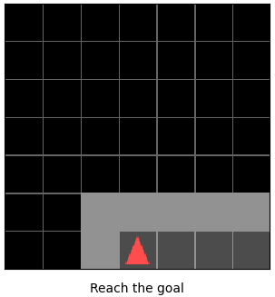
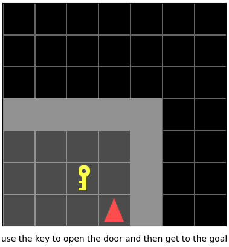

# HRL-options-metrics
Design of HRL options metrics for AI to Human teaching


# Installation

1. git clone this repository.

2. Initialize submodules:

```bach
git submodule update --init --recursive
```

3. Install submodules

Crafting
```bach
pip install -e .\crafting
```

Minigrid
```bach
pip install -e .\minigrid
```

# Quickstart

## Crafting
Human experiment:
```bach
python -m crafting.examples.minecraft.rendering
```

<a href="https://github.com/MathisFederico/Crafting">
  
</a>

## MiniGrid

### FourRooms
```bach
python -m minigrid.manual_control --env MiniGrid-FourRooms-v0 --agent_view
```

<a href="https://github.com/maximecb/gym-minigrid">
  
</a>


### KeyDoor
```bach
python -m minigrid.manual_control --env MiniGrid-DoorKey-8x8-v0 --agent_view
```

<a href="https://github.com/maximecb/gym-minigrid">
  
</a>
